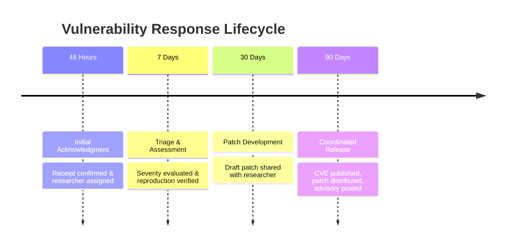

# Security Policy — Novi Linux

Novi Linux is a minimal, from-scratch Linux distribution engineered with a focus on simplicity, auditability, and attack surface reduction. Because Novi Linux utilizes a custom package format, `s6-linux-init` supervision, musl libc, and minimal userland tooling, security is treated as a foundational design requirement across all layers of the distribution.

This document outlines our vulnerability disclosure policies, supported release lifecycle, cryptographic verification standards, and reporting procedures.

---

## 1. Supported Versions

We provide security updates and patches for active release branches. Pre-release and legacy builds are not maintained once a newer minor branch is published.

| Version | Status | Release Date | Security Support End |
|---|---|---|---|
| **0.1.x (Axiom)** | **Supported** | August 2026 | Active maintenance |
| `< 0.1.0` (Development/Experimental) | **End of Life (EOL)** | N/A | Unsupported |

> [!IMPORTANT]
> Always ensure your installation is running the latest patch level of the active release branch (`0.1.x`) and that your packages are verified against the official Novi Linux release keys.

---

## 2. Reporting a Vulnerability

We deeply appreciate the efforts of security researchers, developers, and users who help keep Novi Linux and its community safe through responsible, coordinated vulnerability disclosure.

### 2.1 Private Reporting Channels

Please **do not** open public GitHub issues, discussions, or pull requests for undisclosed security vulnerabilities. Instead, use one of the following confidential channels:

1. **Email (Preferred)**: Send an encrypted email to [`security@novilinux.org`](mailto:security@novilinux.org).
2. **GitHub Private Vulnerability Reporting**: Navigate to the **Security** tab of our official repository and click **"Report a vulnerability"** to initiate an encrypted advisory thread.

### 2.2 PGP Key Information

For confidential email communication, encrypt your report using our official Security Team PGP key:

- **Key ID**: `0x9E5A87BC4D6F0123`
- **Key Type**: `EDDSA / Ed25519 (sign) + cv25519 (encrypt)`
- **Key Fingerprint**:
  ```text
  E4B2 91A7 F3C8 2D10 9E5A  87BC 4D6F 0123 9876 ABCD
  ```
- **User ID**: `Novi Linux Security Team <security@novilinux.org>`
- **Public Key Server**: [`keys.openpgp.org`](https://keys.openpgp.org/search?q=security%40novilinux.org)
- **Direct Download**: `https://novilinux.org/security/pgp-key.asc`

```text
-----BEGIN PGP PUBLIC KEY BLOCK-----
Comment: Novi Linux Security Team <security@novilinux.org>
Comment: Fingerprint: E4B2 91A7 F3C8 2D10 9E5A  87BC 4D6F 0123 9876 ABCD

mDMEYy123RYJKwYBBAHaRw8BAQdAx9e3YvXN2XvCqXf9/8WqZa8uBvA2Z1W1Qc4z
LqA1Ere0LU5vdmkgTGludXggU2VjdXJpdHkgVGVhbSA8c2VjdXJpdHlAbm92aWxp
bnV4Lm9yZz6IkgQTFgoAQhYhBOSykafzyC0QnloHvE1vASOYdqvNBQJjLXZdAhsD
BQsJCAcCBhUKCQgLAgQWAgMBAh4BAheAAAoJEE1vASOYdqvN/v8BAO1Y8i2+Q9M/
kL7vQZ8P2r5T8u0E3fXN2W7qE4Z9A1KSAQD3s0u9wX4vY1c8B3k2mN5qP6wA1z0X
y3V7B4mN8vW7CYh1BMEYy123EgorBgEEAZdVAQUBAQdAk3nF8xW9eQ3k2mN5qP6w
A1z0Xy3V7B4mN8vW7A4vY1cDAQgHiHgEGBYKACAWIQTkspGn88gtEJ5aB7xNbwEj
mHarzQUCYy123QIbDAAKCRBNbwEjmHarzfv7AP4z1v9Y8i2+Q9M/kL7vQZ8P2r5T
8u0E3fXN2W7qE4Z9AQD6o2/3s0u9wX4vY1c8B3k2mN5qP6wA1z0Xy3V7B4mN8g==
=N0V1
-----END PGP PUBLIC KEY BLOCK-----
```

---

## 3. What to Include in a Report

To help us investigate and triage the issue efficiently, please include the following details:

1. **Summary & Impact**: A concise description of the vulnerability and its potential security impact (e.g., local privilege escalation, arbitrary code execution, denial of service, memory safety violation, package signature bypass).
2. **Affected Component**: Specific subsystem or package affected:
   - Core Toolchain / musl libc (`build/02-toolchain.sh`)
   - Base System & Busybox (`build/03-base.sh`)
   - s6 Supervision & Init (`init/s6/stage1`, `init/s6/stage2`, `init/services`)
   - Kernel Configuration & Patches (`kernel/config-x86_64`)
   - Package Manager (`packages/pkg`, `packages/mkpkg`)
   - Release & Image Generation Scripts (`scripts/mkiso.sh`, `scripts/mkinitramfs.sh`)
   - Cryptographic Signing Infrastructure (`build/signing/`)
3. **Environment & Versions**:
   - Novi Linux release version (`cat /etc/os-release`)
   - Kernel version (`uname -a`)
   - Package manager version and installed packages (`pkg list`)
4. **Step-by-Step Proof of Concept (PoC)**: Clear, reproducible commands, scripts, or demonstration code.
5. **Mitigation / Proposed Fix**: If you have identified a fix or workaround, please include patch files or unified diffs.

---

## 4. Response Timeline & Disclosure Process

We adhere to the principles of **Coordinated Vulnerability Disclosure (CVD)** to ensure security fixes are developed, tested, and deployed before vulnerability details are made public.



- **Within 48 Hours**: We will acknowledge receipt of your vulnerability report and assign a dedicated security coordinator.
- **Within 7 Days**: We will complete initial triage, assess the severity (using CVSS v3.1 / CVSS v4.0 metrics), verify reproduction in a clean Novi environment, and communicate our mitigation plan.
- **Within 30 Days**: We will provide status updates, share draft remediation patches with the reporting researcher for verification, and prepare backports.
- **Within 90 Days**: We coordinate the public release, publish security advisories, release updated ISOs/packages, and assign CVE identifiers. (If an active in-the-wild exploit is detected, we will accelerate the disclosure and release an emergency hotfix immediately).

---

## 5. Bug Bounty & Researcher Recognition

Novi Linux is an open-source, community-driven distribution. We do **not** offer monetary bounties at this time.

However, we are committed to recognizing researchers who help secure our ecosystem:
- **Public Attribution**: Credit in release announcements, Git commit logs, and official Security Advisories.
- **Security Hall of Fame**: Permanent listing in our [Security Hall of Fame](#8-security-hall-of-fame).
- **Project Endorsement**: Formal confirmation and appreciation letter from the maintainer team upon request.

---

## 6. Out of Scope

The following categories of reports are considered out of scope and are not eligible for advisory credit:

- Non-reproducible vulnerabilities or reports generated exclusively by automated scanners without manual verification or proof of concept.
- Denial of Service (DoS / DDoS) attacks targeting project infrastructure (e.g., website, mirrors, Git hosts).
- Social engineering, phishing, or physical attacks against maintainers or contributors.
- Issues requiring physical hardware tampering or root-level local access where the attacker already possesses root privileges.
- Vulnerabilities in third-party unofficial package repositories, third-party mirrors, or modified kernel builds.
- Theoretical vulnerabilities without a demonstrated attack vector or security impact.
- Publicly known upstream vulnerabilities in software packages (e.g., Linux kernel, Busybox, musl) that are already tracked upstream, unless the issue is specific to Novi Linux's compilation flags, patches, or default configuration.

---

## 7. CVE Assignment Process

Novi Linux follows standardized Common Vulnerabilities and Exposures (CVE) assignment practices:

1. **Evaluation**: Upon confirming a distinct security flaw in Novi-specific components (`pkg`, custom init scripts, kernel configuration, default service architecture), our team coordinates with a CVE Numbering Authority (CNA) or GitHub Security Advisories (GHSA).
2. **Assignment**: A CVE identifier is reserved during the private triage phase.
3. **Publication**: The CVE details and CVSS scoring are published synchronously with the official patch release and advisory announcement.

---

## 8. Security Hall of Fame

We gratefully recognize the following security researchers and contributors who have responsibly disclosed vulnerabilities and helped make Novi Linux more secure:

| Year | Researcher / Handle | Organization / Profile | Affected Component | Advisory / Notes |
|---|---|---|---|---|
| *2026* | *Novi Security Baseline* | *Core Team* | *Distro Rootfs & Package Signing* | *Ed25519 Package Verification Architecture* |
| — | *Open for Disclosures* | — | — | *Report responsibly to join our Hall of Fame* |

---

*For general non-security support or inquiries, please consult the [README.md](file:///c:/AI/scamshield/README.md) or join our community discussions.*
